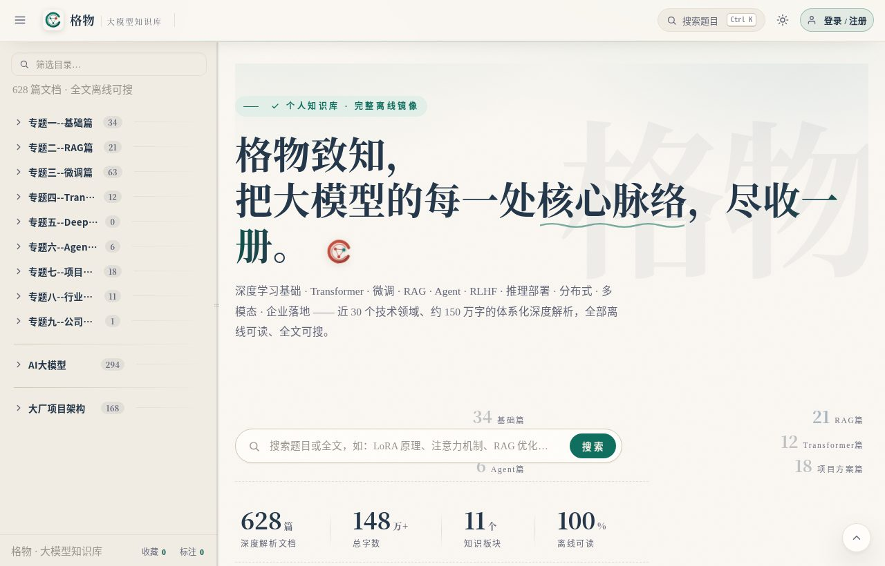
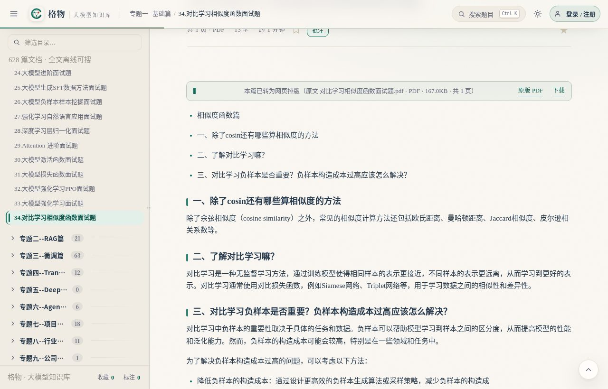
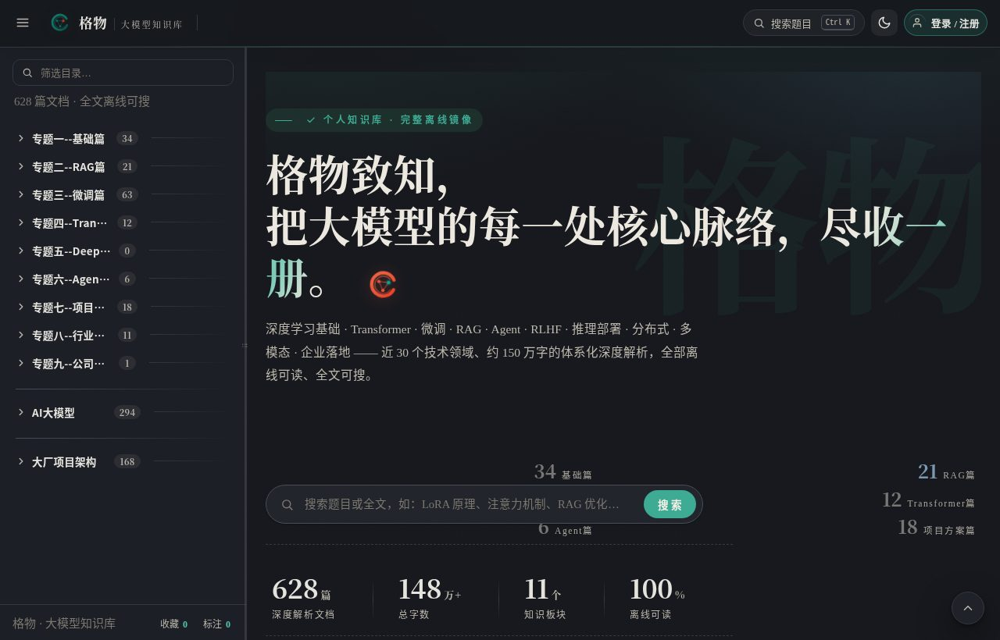

# 格物 · 大模型知识库

> 一个能装进 U 盘的离线知识库：628 篇技术解析、全文搜索、PDF 转网页阅读。打开浏览器就能用，不联网、不装数据库、没有外部依赖。


## 界面预览





## 内容规模

| | |
|---|---|
| 文档 | 628 篇深度解析，约 150 万字（另有 20 篇在源库已删除/占位，页面里做了标注） |
| 图片 | 2942 张公式、图表，全部本地化，断网也能看 |
| 附件 | 195 个 PDF / ZIP，直接下载 |
| PDF | 159 份转成了网页阅读（约 4700 页高清页图内嵌正文，设计排版类整页原图直出） |
| 搜索 | 标题 + 正文全文索引，离线可搜 |

## Features

- **目录**：板块层级与源库一致，文档序号连续；侧栏可以拖着调宽，标题截断了悬停看全名
- **全文搜索**：`Ctrl/Cmd + K` 唤起，标题正文一起搜，结果带高亮摘要，方向键直接选
- **书签**：右下角丝带，随手一按，任何时候点一下就能回到上次读到的位置
- **标注**：选中文字或图片直接批注，正文高亮 + 页边卡片 + 牵引线，和飞书文档一个手感
- **收藏**：一键收藏，侧栏「我的收藏」统一管理
- **账号**：邮箱注册登录，收藏/标注/书签按账号云端隔离；登录前攒的数据会自动并进账号
- **PDF 阅读**：文本型 PDF 还原成网页排版；设计稿类的整页原图内嵌，点击放大
- **阅读细节**：大纲滚动联动、阅读进度条、上下篇、图片灯箱、代码一键复制、明暗主题记忆

## Quick Start

Python 3.9+ 就够了，SQLite 内置，没有别的依赖：

```bash
python3 app.py            # → http://127.0.0.1:8686
python3 app.py 9000       # 换个端口也行
```

访客能直接读全部内容（数据存在浏览器里）；点右上角「登录 / 注册」建个账号，收藏、标注、书签就存到云端了，换设备登录同一个账号接着用。

## Deployment

```bash
pip install flask gunicorn
gunicorn -w 2 -b 127.0.0.1:8686 app:app
```

前面建议挂一层 nginx 或 Caddy 做 HTTPS 和静态加速（图片和 PDF 页图比较多）。资源方面：磁盘留 5 GB 左右，内存 128 MB 起步，1 核 CPU 个人用完全够。

## Rebuild (可选)

`data/` 里的构建产物已经全了，开箱即用。想从原始快照重新生成：

```bash
python3 tools/build_data.py        # 读 _raw/，重新产出 data/
python3 tools/verify_content.py    # 校验 PDF 转网页的还原度
```

## Structure

```text
.
├── app.py                 # Flask：静态站点 + 账号体系 + 管理接口
├── index.html             # 单页应用入口
├── assets/                # 前端脚本、设计系统、图标、PDF 页图与正文图片
├── data/                  # 构建产物：目录、分块正文、全文搜索索引
├── attachments/           # 附件本地化副本
├── tools/                 # 构建与校验脚本
└── _raw/                  # 原始快照（docs / toc / imgmap）与运行数据库
```

## Tech Stack

- Backend: Python + Flask + SQLite（PBKDF2 密码哈希，零外部服务）
- Frontend: 原生 JavaScript SPA + CSS 变量设计系统，无框架无构建
- Pipeline: 语雀文档转换、pdfminer 版面还原、PyMuPDF 页面渲染

## License

[MIT](LICENSE) © Apageoflove
